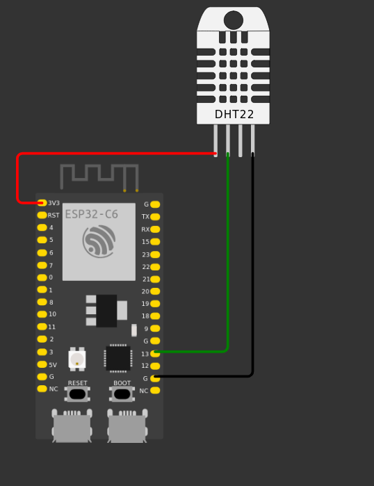

# Weather Logger System

[](https://github.com/marcelo-schreiber/weather/blob/master/LICENSE)  

This project logs weather data (temperature and humidity) using an **ESP32 Wemos Lolin32 with a DHT22 sensor and display**. Data is sent to a **Next.js web application** hosted on **Vercel** for storage and visualization. The backend uses **Supabase** as its database, and a cron job is set up to manage daily data resets.

---

## Table of Contents

- [General Architecture](#general-architecture)
- [Getting Started](#getting-started)
  - [Folder Structure](#folder-structure)
  - [ESP32 Setup](#esp32-setup)
  - [Web Application Setup](#web-application-setup)
- [How It Works](#how-it-works)
  - [ESP32 Data Logging](#esp32-data-logging)
  - [Daily Reset with Cron Job](#daily-reset-with-cron-job)
- [Technologies](#technologies)
- [Feedback](#feedback)

---

## General Architecture

The system architecture is illustrated below:

.png)

---

## Getting Started

### Folder Structure

- **`esp32/`**: Contains the `.ino` file for the ESP32 setup.
- **`webapp/`**: Contains the Next.js application.

---

### ESP32 Setup

0. **Hardware Setup**:
   - Connect the DHT22 sensor to the ESP32 board as follows:
     - VCC -> 3.3V
     - GND -> GND
     - DATA -> 15 (DHT_PIN)
  
     - Connect the ESP32 board to your computer using a USB cable.
    [](docs/circuit.png)

1. Install the required libraries in the Arduino IDE:
   - [DHT Sensor Library](https://github.com/adafruit/DHT-sensor-library)
   - [WiFi](https://www.arduino.cc/en/Reference/WiFi)

2. Open the `esp32.ino` file in the Arduino IDE and update the placeholders with your credentials:

   ```cpp
   const char* ssid = "<WIFI-UUID>";          // Your WiFi SSID
   const char* password = "<WIFI-PASSWORD>";  // Your WiFi password
   const char* api_key = "<API-KEY>";         // API key set in the Next.js app
   String serverName = "<VERCEL-ENDPOINT-URL>"; // The deployed Vercel API URL
   ```

3. Connect the ESP32 to your computer, upload the code, and monitor the serial output for connection status.

### Web Application Setup

1. Clone the repository and navigate to the `webapp/` directory:

    ```bash
      git clone https://github.com/marcelo-schreiber/weather.git
      cd weather/webapp
    ```

2. Go to the `webapp/` directory and create a .env file based on .env.example:

    ```bash
    cp .env.example .env
    ```

3. Update the `.env` file with your credentials

4. Inside the `webapp/` folder, install the dependencies:

      ```bash
      npm install --legacy-peer-deps
      ```

5. To run the application locally, use the following command:

    ```bash
      npm run dev
    ```

6. To deploy the application to Vercel, use the following command:

    ```bash
      vercel
    ```

7. Configure a cron job using [cron-job.org](https://cron-job.org/en/) to send a GET request to `/api/cron` daily at 00:01, make sure to add a header with the CRON_SECRET

    ```bash
      Authorization: Bearer <CRON_SECRET>
    ```

---

## How It Works

### ESP32 Data Logging

- The ESP32 collects temperature and humidity data every minute using a DHT22 sensor.
- The collected data is sent as a `POST` request to the `/api` endpoint of the deployed Next.js application. The JSON payload structure:

   ```json
   {
     "apiKey": "<API-KEY>",
     "temperature": 25.5,
     "humidity": 60.2
   }
   ```

- The Next.js app validates the request using the API key and stores the data in a Supabase database.

### Daily Reset with Cron Job

- A cron job sends a GET request to the `/api/cron` endpoint daily at 00:01.
- The `/api/cron` handler:
  - Calculates the mean and median for the temperature and humidity data in the last 24 hours.
  - Resets the daily data into a single summary record.

## Technologies

- **ESP32 Wemos Lolin32**: Microcontroller board with built-in Wi-Fi and Bluetooth.
- **DHT22 Sensor**: Digital temperature and humidity sensor.
- **Next.js**: React framework for building web applications.
- **Vercel**: Cloud platform for static sites and serverless functions.
- **Supabase**: Open-source Firebase alternative for databases and authentication.
- **Cron-job.org**: Free online cron job service.

## Feedback

If you have feedback or suggestions, feel free to reach out at `marcelorissette15@gmail.com`.
