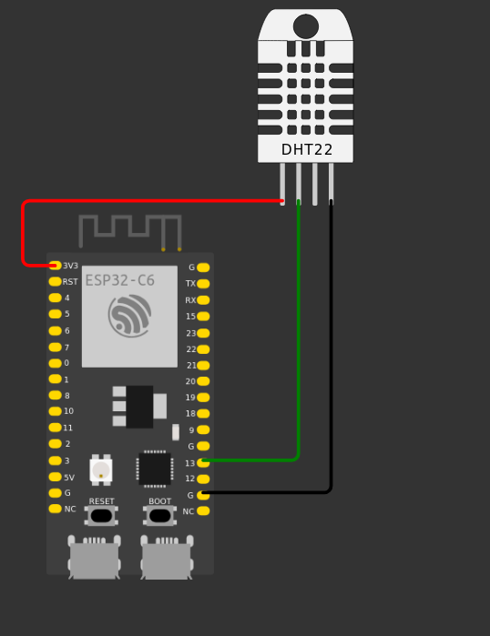

# Sistema de Registro Climático

[](https://github.com/marcelo-schreiber/weather/blob/master/LICENSE)  

Este projeto registra dados climáticos (temperatura e umidade) usando um **ESP32 Wemos Lolin32 com um sensor DHT22 e display**. Os dados são enviados para uma **aplicação web Next.js** hospedada no **Vercel** para armazenamento e visualização. O backend utiliza o **Supabase** como banco de dados, e um cron job é configurado para gerenciar reinicializações diárias dos dados.

---

## Tabela de Conteúdos

- [Arquitetura Geral](#arquitetura-geral)
- [Iniciando](#iniciando)
  - [Estrutura de Pastas](#estrutura-de-pastas)
  - [Configuração do ESP32](#configuração-do-esp32)
  - [Configuração da Aplicação Web](#configuração-da-aplicação-web)
- [Como Funciona](#como-funciona)
  - [Registro de Dados pelo ESP32](#registro-de-dados-pelo-esp32)
  - [Reinicialização Diária com Cron Job](#reinicialização-diária-com-cron-job)
- [Tecnologias](#tecnologias)
- [Feedback](#feedback)

---

## Arquitetura Geral

A arquitetura do sistema é ilustrada abaixo:

.png)

---

## Iniciando

### Estrutura de Pastas

- **`esp32/`**: Contém o arquivo `.ino` para configuração do ESP32.
- **`webapp/`**: Contém a aplicação Next.js.

---

### Configuração do ESP32

0. **Configuração de Hardware**:
   - Conecte o sensor DHT22 à placa ESP32 da seguinte forma:
     - VCC -> 3.3V
     - GND -> GND
     - DATA -> 15 (DHT_PIN)
  
   - Conecte a placa ESP32 ao computador usando um cabo USB.
   [](docs/circuit.png)

1. Instale as bibliotecas necessárias no Arduino IDE:
   - [DHT Sensor Library](https://github.com/adafruit/DHT-sensor-library)
   - [WiFi](https://www.arduino.cc/en/Reference/WiFi)

2. Abra o arquivo `esp32.ino` no Arduino IDE e atualize os espaços reservados com suas credenciais:

   ```cpp
   const char* ssid = "<WIFI-UUID>";          // Seu SSID WiFi
   const char* password = "<WIFI-PASSWORD>";  // Sua senha WiFi
   const char* api_key = "<API-KEY>";         // API key configurada na aplicação Next.js
   String serverName = "<VERCEL-ENDPOINT-URL>"; // URL da API no Vercel
   ```

3. Conecte o ESP32 ao computador, carregue o código e monitore a saída serial para verificar o status da conexão.

---

### Configuração da Aplicação Web

1. Clone o repositório e navegue até o diretório `webapp/`:

    ```bash
    git clone https://github.com/marcelo-schreiber/weather.git
    cd weather/webapp
    ```

2. No diretório `webapp/`, crie um arquivo `.env` baseado em `.env.example`:

    ```bash
    cp .env.example .env
    ```

3. Atualize o arquivo `.env` com suas credenciais.

4. Dentro do diretório `webapp/`, instale as dependências:

    ```bash
    npm install --legacy-peer-deps
    ```

5. Para rodar a aplicação localmente, use o comando:

    ```bash
    npm run dev
    ```

6. Para implantar a aplicação no Vercel, use o comando:

    ```bash
    vercel
    ```

7. Configure um cron job usando o [cron-job.org](https://cron-job.org/en/) para enviar uma solicitação GET para `/api/cron` diariamente às 00:01. Certifique-se de adicionar um cabeçalho com o `CRON_SECRET`:

    ```bash
    Authorization: Bearer <CRON_SECRET>
    ```

---

## Como Funciona

### Registro de Dados pelo ESP32

- O ESP32 coleta dados de temperatura e umidade a cada minuto usando um sensor DHT22.
- Os dados coletados são enviados como uma solicitação `POST` para o endpoint `/api` da aplicação Next.js implantada. O formato do payload JSON:

   ```json
   {
     "apiKey": "<API-KEY>",
     "temperature": 25.5,
     "humidity": 60.2
   }
   ```

- A aplicação Next.js valida a solicitação usando a API key e armazena os dados em um banco de dados Supabase.

### Reinicialização Diária com Cron Job

- Um cron job envia uma solicitação GET para o endpoint `/api/cron` diariamente às 00:01.
- O manipulador do endpoint `/api/cron`:
  - Calcula a média e a mediana dos dados de temperatura e umidade nas últimas 24 horas.
  - Reseta os dados diários em um único registro resumido.

---

## Tecnologias

- **ESP32 Wemos Lolin32**: Placa microcontroladora com Wi-Fi e Bluetooth integrados.
- **Sensor DHT22**: Sensor digital de temperatura e umidade.
- **Next.js**: Framework React para construção de aplicações web.
- **Vercel**: Plataforma de cloud para sites estáticos e funções serverless.
- **Supabase**: Alternativa open-source ao Firebase para banco de dados e autenticação.
- **Cron-job.org**: Serviço gratuito de cron jobs online.

---

## Feedback

Se você tiver feedback ou sugestões, entre em contato pelo e-mail `marcelorissette15@gmail.com`.
